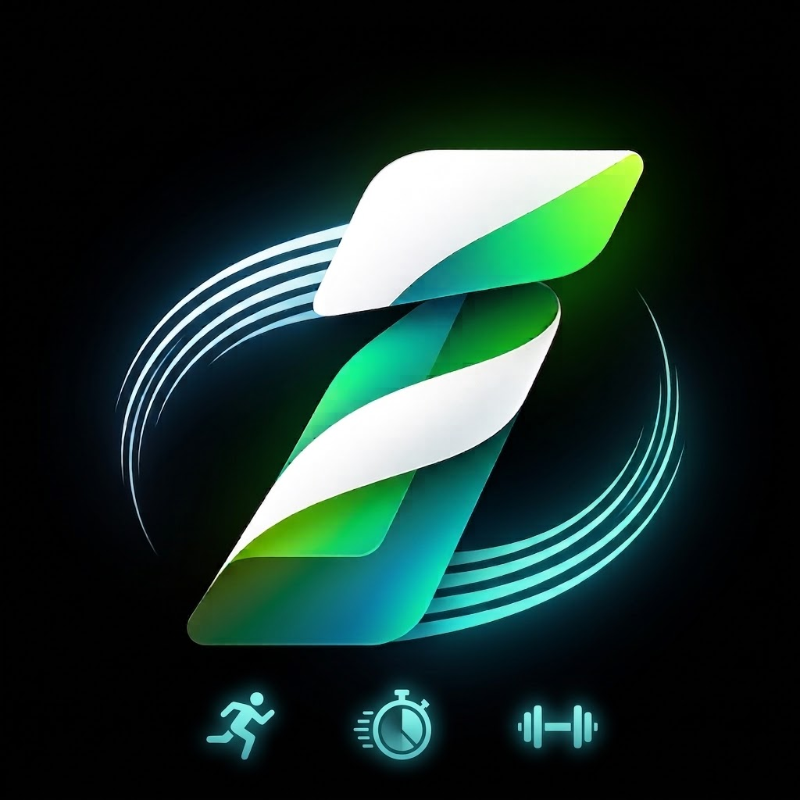

# ⚡ ImpuApp — Entrenador Atlético & Reloj Deportivo Inteligente

<p align="center">
  
</p>

<p align="center">
  <b>Aplicación de entrenamiento atlético, cronómetros de intervalos HIIT, zonas runner y seguimiento de fuerza en gimnasio.</b><br />
  <i>100% gratuita, de código abierto y completamente funcional sin conexión (Offline-First).</i>
</p>

<p align="center">
  
  
  
  
  
</p>

<p align="center">
  <a href="https://github.com/rdbergeruser-stack/ImpuApp/releases/latest/download/ImpuApp-v1.0.4.apk">
    
  </a>
</p>

---

## 🚀 Características Principales

### ⏱️ 1. Reloj Tabata & HIIT de Alta Intensidad
- **Intervalos de alta precisión**: Configuración libre de tiempo de preparación, trabajo, descanso, ciclos y series.
- **Entrenador por Voz en Español**: Guiado vocal nativo con dos voces seleccionables (**Sofía** y **Mateo**), calibradas para una sincronización exacta con el conteo regresivo 3-2-1.
- **Alertas Hápticas y Sonoras**: Señales de audio binaural y vibraciones táctiles al cambiar de fase.
- **Mantener pantalla encendida (WakeLock)**: Evita que el celular se apague durante el entrenamiento.

### 🏃 2. Reloj Runner por Zonas Cardíacas (Z1 a Z5)
- **Entrenamiento por Zonas de Pulso**: Intervalos estructurados para cuestas, series de velocidad (400m), fartlek y tiradas largas.
- **Instrucciones por fase**: Notificaciones de ritmo y avisos de cambio de zona en tiempo real.

### 🏋️ 3. Tracker de Rutinas de Gimnasio
- **Seguimiento serie por serie**: Registro individual de peso (kg) y repeticiones sin saltos molestos de pantalla.
- **Temporizador de descanso automático**: Conteo regresivo configurable entre series.
- **Cálculo de volumen total**: Sumatoria automática de kilogramos levantados en cada sesión.

### 📊 4. Perfil de Atleta & Métricas
- **Onboarding de bienvenida**: Configuración inicial para ingresar nombre/apodo, edad, altura, peso y nivel atlético.
- **Historial de sesiones**: Registro de tiempo total, calorías estimadas y volumen acumulado.
- **Botón de reinicio rápido**: Posibilidad de reiniciar estadísticas o restaurar valores de fábrica con un solo toque.

### 🎨 5. Personalización Estética Kinetic & Neón
- **Modos de fondo**: Negro OLED puro (máximo ahorro de batería), Slate y Modo Claro.
- **Acentos de color neón**: Verde Volt, Láser Ciano, Coral Neón, Ámbar y Púrpura.
- **Tipografía moderna**: Interfaz estilizada con la tipografía **Montserrat** de Google Fonts.

---

## 📁 Estructura del Repositorio

El proyecto está diseñado bajo una arquitectura híbrida de alto rendimiento:

```text
ImpuApp/
├── impulso_app/             # Aplicación Web Core (Frontend)
│   ├── src/
│   │   ├── audio/           # Motor de síntesis de voz, sonidos binaurales y Web Audio
│   │   ├── components/      # Componentes UI reutilizables (Header, Nav, etc.)
│   │   ├── store/           # Manejo de persistencia local y presets de rutinas
│   │   ├── utils/           # Háptica, formato de tiempo, cálculo biométrico y WakeLock
│   │   ├── views/           # Pantallas (Onboarding, Tabata, Runner, Gym, Perfil, etc.)
│   │   ├── main.js          # Router y punto de entrada de la aplicación
│   │   └── style.css        # Configuración de estilos y temas de color
│   ├── index.html           # Plantilla HTML con tipografía Montserrat
│   └── package.json         # Dependencias web (Vite)
│
├── impulso_expo/            # Wrapper Nativo Android / iOS (Expo)
│   ├── assets/              # Íconos adaptativos, splash screen y gráficos
│   ├── App.js               # Puente nativo (WebView, Speech, Haptics, AsyncStorage)
│   ├── app.json             # Manifiesto de Expo y configuración de Android
│   ├── eas.json             # Configuración de compilación en la nube (EAS Build)
│   ├── generateBundle.js    # Script que empaqueta impulso_app dentro del entorno nativo
│   └── package.json         # Dependencias de Expo y React Native
│
├── Icono/                   # Logotipos originales 3D en alta resolución
├── .gitignore               # Exclusiones de Git (node_modules, builds, temporales)
├── LICENSE                  # Licencia de código abierto MIT
└── README.md                # Documentación oficial
```

---

## 🛠️ Instalación y Desarrollo Local

### Requisitos previos
- [Node.js](https://nodejs.org/) (versión 18 o superior recomendada)
- [Git](https://git-scm.com/)
- Aplicación **Expo Go** instalada en tu teléfono Android o iOS

### 1. Clonar el repositorio
```bash
git clone https://github.com/rdbergeruser-stack/ImpuApp.git
cd ImpuApp
```

### 2. Probar la aplicación Web en tu navegador
```bash
cd impulso_app
npm install
npm run dev
```

### 3. Ejecutar la aplicación en tu celular con Expo Go
```bash
# Compilar el bundle web
cd ../impulso_app
npm run build

# Empaquetar y arrancar Expo
cd ../impulso_expo
npm install
node generateBundle.js
npx expo start
```
Escanea el código QR desde la aplicación **Expo Go** en tu teléfono conectado a la misma red Wi-Fi.

---

## 📦 Compilar el Instalador APK para Android

Para generar un archivo instalable `.apk` en la nube utilizando **Expo Application Services (EAS)**:

```bash
cd impulso_expo
npx eas-cli build --platform android --profile preview
```
Al finalizar, EAS proporcionará un enlace directo para descargar e instalar el archivo APK en cualquier dispositivo Android.

---

## 📄 Licencia

Este proyecto se distribuye bajo la licencia **MIT**. Consulta el archivo [LICENSE](LICENSE) para más detalles.
Eres libre de usar, modificar y distribuir esta aplicación según los términos de la licencia.
